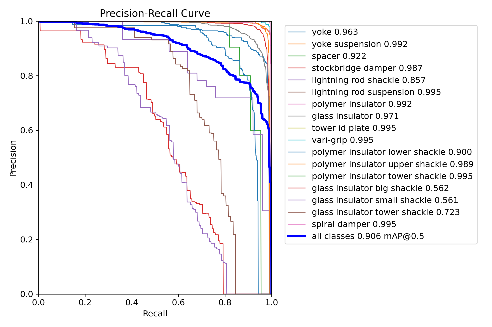
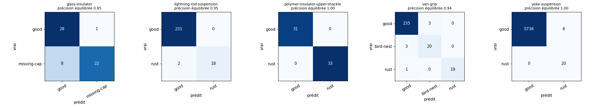
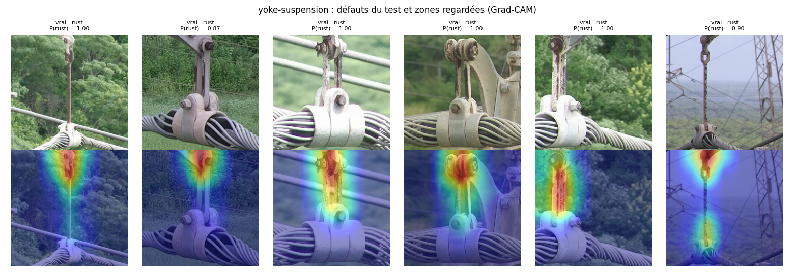
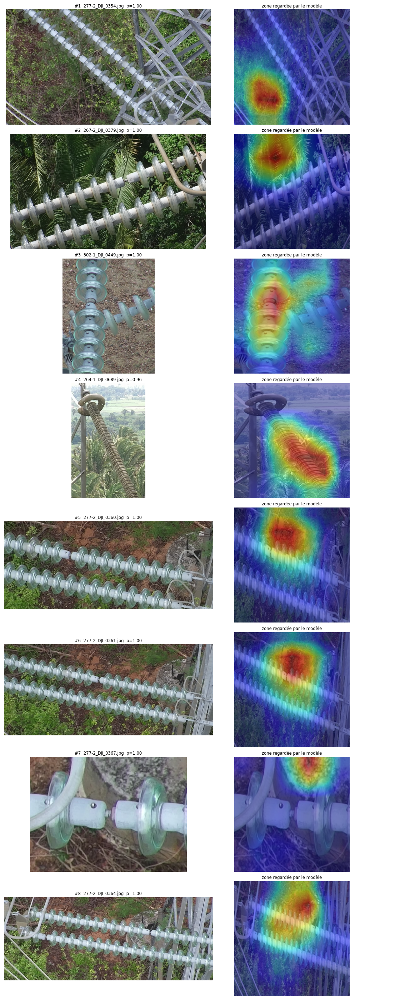
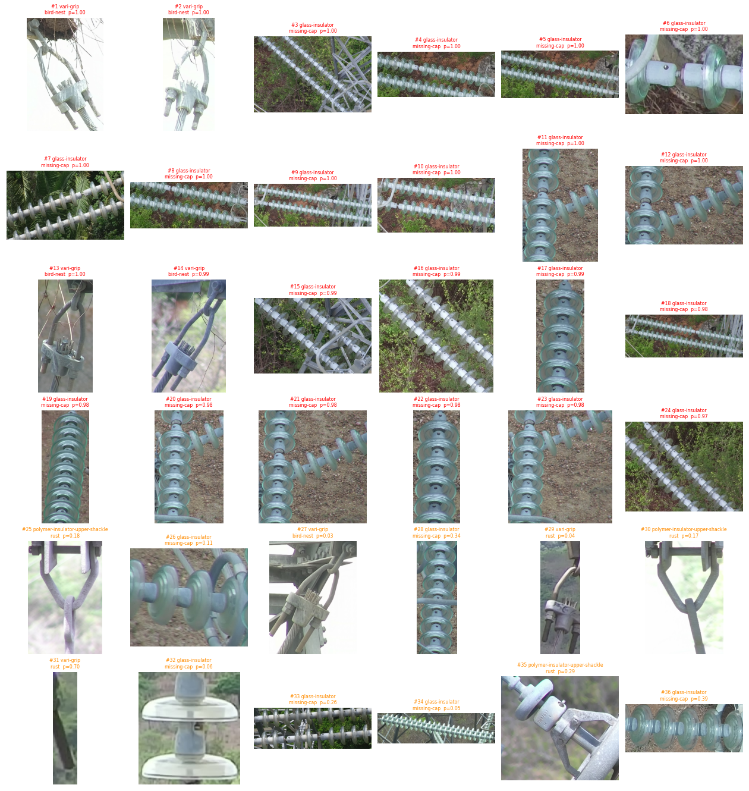

# VoltSight - inspection de lignes électriques par drone

Projet personnel en science des données (UQAC). L'idée : partir de photos de drone d'installations électriques, détecter les équipements, repérer ceux qui ont un défaut (rouille, nid d'oiseau, disque de verre manquant) et sortir une liste d'interventions par pylône.

Je me suis inspiré de ce qui se fait en inspection de lignes chez Hydro-Québec (LineScout, LineDrone, le projet CableInspect-AD avec Mila). Les données utilisées sont publiques (InsPLAD et CPLID) ; ce ne sont pas des données d'Hydro-Québec.

Tableau de bord en ligne : https://vamssy47.github.io/voltsight/tableau_de_bord.html

## Résumé des résultats

| Étape | Résultat |
| --- | --- |
| Détection de 17 types d'équipements (YOLO11s, InsPLAD) | mAP@0.5:0.95 = 0,740 (article de référence, DetectoRS : 0,721) |
| Diagnostic des défauts (EfficientNet-B0, 5 équipements) | précision équilibrée moyenne 0,947 (article : 0,954) |
| Seuil d'alerte basé sur le coût | 143 défauts trouvés sur 146, 0,7 % de fausses alertes |
| Pipeline complet photo -> liste de réparations | 2 626 photos en 115 s (44 ms par photo, GPU T4) |

Ce que je retiens surtout du projet, ce sont les problèmes trouvés en cours de route : un modèle qui « trichait » sur CPLID, des noms de classes incohérents et une fuite entre entraînement et test dans InsPLAD, et un seuil qui ne se transfère pas bien d'un jeu de données à l'autre. Tout est détaillé plus bas.

## Avancement

| Phase | Contenu | État |
| --- | --- | --- |
| 1 | Données CPLID, découpes, division sans fuite | fait |
| 2 | BPNN codé à la main en NumPy (gradient vérifié) | fait |
| 3 | Test de masquage, raccourci découvert, CNN contrefactuel, Grad-CAM | fait |
| 4 | Ensemble de 3 modèles, seuil selon le coût d'un défaut manqué | fait |
| 5.1 - 5.2 | Détection des équipements sur InsPLAD avec YOLO11s | fait |
| 5.3 | Diagnostic des défauts, audit du jeu de données | fait |
| 5.4 | Pipeline complet + vérification à l'œil des alertes | fait |
| 6 | Tableau de bord (alertes par pylône) | fait |
| 7 | Végétation, données de capteurs | à faire |
| 8 | Service d'inférence, carte avec de vraies coordonnées | à faire |

## Phase 5.2 : détection des équipements

InsPLAD contient 10 607 photos de drone (1920 x 1080) de lignes électriques avec 28 959 boîtes annotées. J'ai gardé la division de l'article : 7 981 photos pour l'entraînement, 2 626 pour le test. Le modèle est YOLO11s pré-entraîné sur COCO, réentraîné 30 époques sur un GPU T4 dans Colab.

| | YOLO11s (ce projet) | DetectoRS (article) |
| --- | --- | --- |
| mAP@0.5:0.95 | 0,740 | 0,721 |
| mAP@0.5 | 0,906 | - |
| Précision / rappel | 0,90 / 0,87 | - |
| Temps par image | 3 à 6 ms (T4) | modèle beaucoup plus lourd |

Les classes les mieux détectées sont la plaque d'identification du pylône (AP 0,99), l'isolateur polymère (0,96), le vari-grip (0,96) et l'amortisseur spiralé (0,93).

Les petites manilles d'isolateur en verre posent problème (AP 0,30 et 0,33, environ une sur deux ratée). Elles sont minuscules une fois la photo réduite à 640 pixels et il y en a peu dans l'entraînement. Le modèle confond aussi parfois le joug et la suspension de joug.

Limites : j'ai gardé le meilleur modèle d'après le score sur ce même ensemble de test (l'écart entre les dernières époques est faible, 0,735 à 0,740), et mes outils d'évaluation ne sont pas exactement ceux de l'article. Je parle donc de résultat comparable, pas meilleur. Pour aller plus loin : images en 1024 pixels et découpage en tuiles (SAHI) pour les petits objets.



Notebooks : [05_insplad_exploration](notebooks/05_insplad_exploration.ipynb), [06_yolo_detection](notebooks/06_yolo_detection.ipynb)

## Phase 5.3 : diagnostic des défauts

Ici on part des découpes d'équipements de la partie `supervised_fault_classification` d'InsPLAD, et on entraîne un EfficientNet-B0 par équipement, comme dans l'article.

| Équipement | Défaut | Précision équilibrée | Défauts trouvés (seuil coût) | Fausses alertes |
| --- | --- | --- | --- | --- |
| Isolateur polymère (manille) | rouille | 1,000 | 33 / 33 | 3 / 31 |
| Suspension de joug | rouille | 0,9995 | 20 / 20 | 7 / 5 742 |
| Suspension de paratonnerre | rouille | 0,950 | 19 / 20 | 0 / 231 |
| Vari-grip | rouille, nid d'oiseau | 0,936 | 42 / 43 | 26 / 238 |
| Isolateur en verre | capuchon manquant | 0,849 | 29 / 30 | 6 / 29 |
| Total | | 0,947 (article 0,954) | 143 / 146 | 42 / 6 271 |

Pour décider quand déclencher une alerte, j'ai considéré qu'un défaut manqué coûte autant que 10 fausses alertes. Le seuil est choisi par validation croisée sur l'entraînement (en séparant par photo de drone), jamais sur le test. Comparé à la règle simple « classe la plus probable », ça donne :

| Règle | Défauts trouvés | Fausses alertes | Coût |
| --- | --- | --- | --- |
| Classe la plus probable | 132 / 146 | 10 | 150 |
| Seuil basé sur le coût | 143 / 146 | 42 | 72 |

Ma première version choisissait le seuil sur une petite validation et il était instable (parfois pire que la règle simple). La validation croisée a réglé ça.

Deux problèmes dans les données :

- Pour l'isolateur polymère, les dossiers d'entraînement sont nommés en portugais (« normal », « corrosão ») et ceux du test en anglais (« good », « rust »). Sans corriger les noms, le score tombe à 0 alors que le modèle a raison.
- Pour 3 équipements, des découpes de la même photo de drone se retrouvent à la fois en entraînement et en test (11, 131 et 268 photos). J'ai comparé les scores sur les photos déjà vues et sur les photos nouvelles : pas d'écart notable (par exemple 0,944 contre 0,930 pour le vari-grip), donc la fuite ne gonfle pas les résultats.

Avec Grad-CAM, le modèle regarde bien la pièce rouillée ou le nid dans la plupart des cas. L'isolateur en verre reste le plus difficile : le capuchon manquant est un petit détail dans une image de 224 pixels.

Limites : les ensembles de test sont petits (20 à 43 défauts par équipement). Le même code a donné 0,998 puis 0,950 pour le paratonnerre selon l'exécution, donc un seul entraînement ne permet pas de dire qu'on bat ou non l'article.





Notebooks : [07_diagnostic_defauts_kaggle](notebooks/07_diagnostic_defauts_kaggle.ipynb) (exécuté sur Kaggle), [07_diagnostic_defauts](notebooks/07_diagnostic_defauts.ipynb) (version Colab)

## Phase 5.4 : pipeline complet

Chaque photo passe dans YOLO, chaque équipement détecté est découpé puis diagnostiqué, et les alertes sont classées par priorité (probabilité x gravité). Les gravités que j'ai utilisées sont arbitraires : nid d'oiseau 3, capuchon manquant 3, rouille 2.

Sur les 2 626 photos de test : 6 465 équipements détectés, 2 986 diagnostiqués, 414 alertes dont 45 urgentes réparties sur 8 structures.

Mesurer le pipeline de bout en bout s'est avéré difficile. Les deux parties d'InsPLAD ne nomment pas les photos de la même façon (« 284-1_DJI_0495 » d'un côté, « Fotos 26-11-2020_DJI_0214 » de l'autre) et viennent surtout de vols différents. J'ai relié les boîtes aux découpes par ressemblance visuelle (empreintes d'un réseau ImageNet, plus proche voisin réciproque, ressemblance d'au moins 0,90). Seules 69 boîtes de test sont étiquetées et jamais vues, dont 2 défauts : YOLO en retrouve 66, les 2 défauts sont signalés, et il y a 3 fausses alertes sur 67. C'est trop peu pour annoncer un taux de détection.

J'ai donc vérifié des alertes à l'œil :

- Sur la structure 277-2, 21 alertes urgentes sur des photos qui se suivent correspondent à un vrai disque de verre manquant, bien visible en gros plan.
- Les alertes « nid d'oiseau » montrent de vrais nids.
- Sur 267-2, c'est une fausse alerte : le modèle regarde des feuilles de palmier.
- Les alertes à faible probabilité (0,03 à 0,39) sont surtout fausses. Le pipeline met en alerte 28 % des isolateurs en verre et 37 % des vari-grips, ce qui n'est pas réaliste.

Conclusion : un seuil réglé sur des découpes propres ne marche pas tel quel sur les boîtes produites par YOLO (gros plans, chaînes coupées par le bord). Avant une vraie utilisation, il faudrait recalibrer le seuil sur un petit échantillon vérifié, n'envoyer que les alertes urgentes, et regrouper par structure (21 alertes = 1 intervention).





Notebook : [08_pipeline_complet_kaggle](notebooks/08_pipeline_complet_kaggle.ipynb)

## Phase 6 : tableau de bord

[docs/tableau_de_bord.html](docs/tableau_de_bord.html), en ligne ici : https://vamssy47.github.io/voltsight/tableau_de_bord.html

Il regroupe les 414 alertes en 45 structures (pylône et côté), avec un schéma de la ligne, un seuil réglable et une fiche par structure (alertes, photos, résultat de la vérification). InsPLAD ne donne pas de coordonnées GPS, donc les pylônes sont simplement rangés par numéro.

## Phases 2 à 4 : BPNN et CNN sur CPLID

| | BPNN + HOG | CNN standard | CNN contrefactuel |
| --- | --- | --- | --- |
| PR-AUC (zones de test) | 0,67 | 1,00 | 1,00 |
| Baisse de probabilité quand on efface le défaut | 0,06 | 0,28 | 0,61 |
| Baisse quand on efface une zone saine (contrôle) | 0,04 | 0,02 | 0,03 |

Le BPNN avait d'abord une PR-AUC de 0,96 sur l'isolateur entier, mais il trichait : dans CPLID, tous les isolateurs défectueux sont des images synthétiques, et le modèle reconnaissait ce montage plutôt que le défaut. Un test de masquage avec contrôle l'a montré. J'ai ensuite reformulé la tâche (zones d'un même isolateur) et entraîné un CNN avec des paires avec / sans défaut ; c'est lui qui réagit vraiment quand on efface le défaut.

Le seuil est choisi selon le même coût (un défaut manqué = 10 fausses alertes). Le rappel est de 0,98 à 1,00 sur deux exécutions, mais le nombre de fausses alertes varie de 1 à 10 sur 150 : la validation est petite.


Détails : [docs/modelisation.md](docs/modelisation.md)

## Organisation du dépôt

```
voltsight/
  src/         code Python (données, BPNN, CNN, évaluation)
  notebooks/   notebooks Colab et Kaggle
  results/     métriques, figures et modèles par étape
  docs/        rapport de modélisation et tableau de bord
  data/        données (non versionnées)
```

## Relancer

Le plus simple est d'ouvrir les notebooks dans Colab ou Kaggle avec un GPU. Pour la partie CPLID en local :

```bash
git clone https://github.com/Vamssy47/voltsight.git
cd voltsight
pip install -r requirements.txt
git clone --depth 1 https://github.com/InsulatorData/InsulatorDataSet.git data/InsulatorDataSet
python src/prepare_data.py --width 256 --height 64 --out data/cplid_crops_256.npz
python src/patch_model.py --data data/cplid_crops_256.npz --patch 64 --out results/etape3_zones_64
python src/cnn_model.py
```

## Données et licence

- InsPLAD : Vieira e Silva et al., 2023, International Journal of Remote Sensing, [Mendeley Data](https://data.mendeley.com/datasets/5n3fjgvfyz/1). Usage de recherche, images non redistribuées ici.
- CPLID : Tao et al., 2018, IEEE Transactions on Systems, Man, and Cybernetics: Systems. Usage académique, images non redistribuées ici.
- Code sous licence MIT.

Vamoussa Diabaté, baccalauréat en sciences des données et intelligence d'affaires, UQAC.
