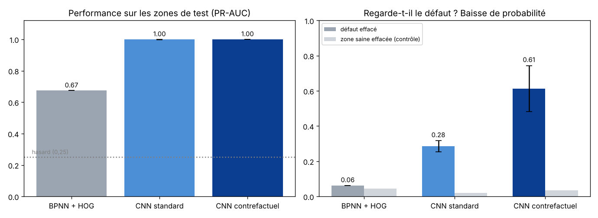

# VoltSight : Inspection de lignes électriques par drone et IA

**Du pixel à la décision :** détecter automatiquement les défauts sur les photos de drone des installations électriques, puis prioriser les réparations.

Projet de portfolio en science des données, inspiré des pratiques d'inspection par drone et par robot d'Hydro-Québec (LineScout, LineDrone, projet CableInspect-AD avec Mila).



## Où en est le projet

| Phase | Contenu | Statut |
| --- | --- | --- |
| 1. Données | Jeu CPLID (isolateurs photographiés par drone), découpes, division sans fuite de données | ✅ |
| 2. Modèle de référence | BPNN codé à la main en NumPy, rétropropagation vérifiée | ✅ |
| 3. Diagnostic des défauts | Détection d'un raccourci, tâche corrigée, CNN contrefactuel, Grad-CAM | ✅ |
| 4. Décision | Ensemble de 3 modèles, seuil fondé sur le coût d'un défaut manqué | ✅ (amélioration prévue : seuil par validation croisée) |
| 5. Défauts réels | InsPLAD / CableInspect-AD, détection YOLO sur l'image entière | ⏳ prochaine étape |
| 6. Végétation et capteurs | Segmentation des lignes, anomalies de capteurs | ⏳ |
| 7. Score de risque et tableau de bord | Priorisation des interventions, API, carte | ⏳ |

## Résultats clés (phase de modélisation)

| | BPNN + HOG | CNN standard | CNN contrefactuel |
| --- | --- | --- | --- |
| PR-AUC (zones de test) | 0,67 | 1,00 | 1,00 |
| Baisse de probabilité quand on efface le défaut | 0,06 | 0,28 | **0,61** |
| Baisse de probabilité quand on efface une zone saine (contrôle) | 0,04 | 0,02 | 0,03 |

- **Le BPNN avait d'abord une PR-AUC de 0,96, mais il trichait.** Il reconnaissait les images synthétiques, pas les défauts ; un test de masquage avec contrôle l'a révélé.
- **Le CNN contrefactuel s'appuie vraiment sur le défaut.** Il a été entraîné avec des paires « avec / sans défaut ».
- **Seuil de décision :** il est fixé selon un coût métier (un défaut manqué = 10 fausses alertes). Le rappel atteint 0,98 à 1,00 sur deux exécutions indépendantes. Le nombre de fausses alertes varie de 1 à 10 sur 150 : c'est une limite connue, due à la petite taille de la validation.

👉 Démarche complète, chiffres et limites : **[docs/modelisation.md](docs/modelisation.md)**

## Structure

```
voltsight/
├── src/                 code Python (données, BPNN, CNN, évaluation)
├── results/             métriques, figures et modèles entraînés, par étape
├── notebooks/           notebook Google Colab pour tout relancer
├── docs/                rapport de modélisation
├── data/                données (non versionnées, téléchargées par les commandes)
└── requirements.txt
```

## Lancer

**Dans Google Colab**, le plus simple : ouvre `notebooks/voltsight_colab.ipynb`, active le GPU, puis « Tout exécuter ».

**Sur mon ordinateur :**

```bash
git clone https://github.com/Vamssy47/voltsight.git
cd voltsight
pip install -r requirements.txt
git clone --depth 1 https://github.com/InsulatorData/InsulatorDataSet.git data/InsulatorDataSet
python src/prepare_data.py --width 256 --height 64 --out data/cplid_crops_256.npz
python src/patch_model.py --data data/cplid_crops_256.npz --patch 64 --out results/etape3_zones_64
python src/cnn_model.py
```

## Données et licence

- **CPLID** (Chinese Power Line Insulator Dataset) : Tao et al., 2018, *IEEE Transactions on Systems, Man, and Cybernetics: Systems*. Licence non précisée par les auteurs ; usage académique uniquement. Les images ne sont pas redistribuées ici.
- **Code :** licence MIT.

## Auteur

Vamoussa Diabaté — baccalauréat en sciences des données et intelligence d'affaires, UQAC.
