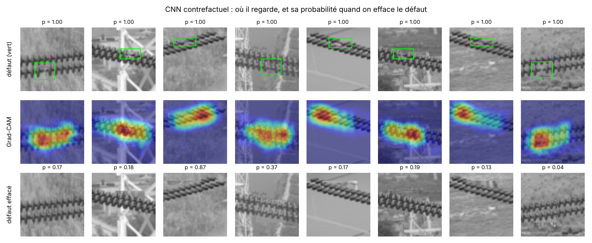
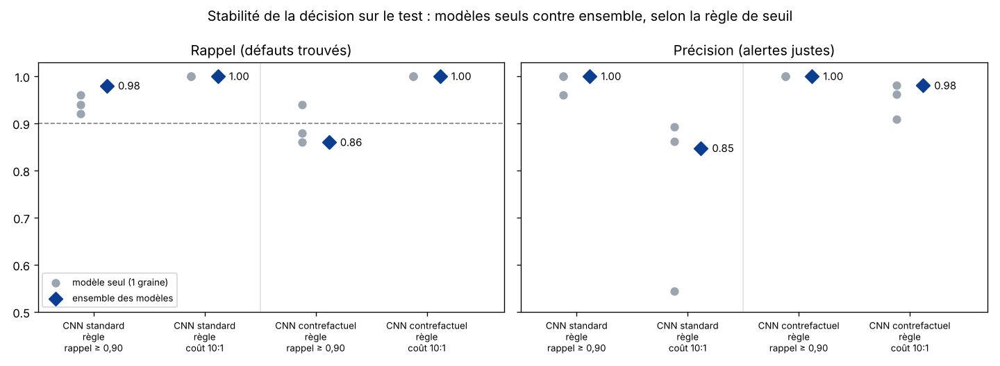

# Rapport de modélisation : du BPNN au CNN

Détecter un isolateur défectueux sur une photo de drone, en deux temps :

1. un BPNN (réseau de neurones à rétropropagation) codé à la main en NumPy, qui sert de modèle de référence ;
2. un CNN (réseau convolutif) en PyTorch, qui doit le battre et prouver qu'il regarde vraiment le défaut.

Conclusion :

- Le BPNN obtient un excellent score, mais il triche. Sur l'isolateur entier, il atteint une PR-AUC de 0,96, mais un test de masquage montre qu'il reconnaît les images synthétiques, pas les défauts.
- Sur une tâche corrigée, le BPNN tombe à 0,67 et ne réagit presque pas quand on efface le défaut.
- Le CNN atteint 1,00 sur la même tâche.
- Le CNN entraîné en « contrefactuel » s'appuie clairement sur le défaut. Quand on efface le défaut, sa probabilité chute de 0,61. Quand on efface une zone saine de même taille, elle ne baisse que de 0,03.
- Le rappel est réparé, mais au prix de fausses alertes en nombre variable. On choisit désormais le seuil selon un coût métier (un défaut manqué = 10 fausses alertes). Sur deux exécutions indépendantes (CPU puis GPU), l'ensemble des 3 CNN trouve 49 ou 50 défauts sur 50, au lieu de 41 à 43. Le nombre de fausses alertes, lui, varie selon l'exécution : de 1 à 10 sur 150.


## Fichiers

| Fichier | Rôle |
| --- | --- |
| `src/prepare_data.py` | Découpe les isolateurs du jeu CPLID, les étiquette, les normalise (niveaux de gris) et regroupe les quasi-doublons |
| `src/bpnn.py` | Le BPNN : propagation avant, perte pondérée, rétropropagation, SGD + momentum, L2, dropout, arrêt précoce, vérification du gradient |
| `src/train_evaluate.py` | Étape 2 : BPNN sur l'isolateur entier, comparaisons, validation croisée, test de masquage. Contient aussi les fonctions d'effacement et de choix du seuil |
| `src/patch_model.py` | Étape 3 : BPNN par zone, pour corriger le raccourci |
| `src/cnn_model.py` | Étapes 4 et 5 : CNN standard et contrefactuel, masquage avec contrôle, Grad-CAM, ensemble des 3 modèles, règles de seuil |
| `results/etape*/` | Métriques (JSON), figures et modèles entraînés de chaque étape |

## Lancer (depuis la racine du dépôt)

```bash
pip install -r requirements.txt
git clone --depth 1 https://github.com/InsulatorData/InsulatorDataSet.git data/InsulatorDataSet

python src/prepare_data.py                                   # environ 10 s
python src/train_evaluate.py                                 # étape 2 : environ 10 min (CPU)
python src/patch_model.py                                    # étape 3, zones 32 x 32

python src/prepare_data.py --width 256 --height 64 --out data/cplid_crops_256.npz
python src/patch_model.py --data data/cplid_crops_256.npz --patch 64 --out results/etape3_zones_64
python src/cnn_model.py                                      # étapes 4 et 5 : environ 5 min (GPU) ou 40 min (CPU)
python src/cnn_model.py --reuse                              # réévaluer sans réentraîner (moins d'une minute)
```

Les résultats ci-dessous ont été obtenus sur CPU avec les versions de `requirements.txt`. Les chiffres varient un peu d'une machine à l'autre (CPU ou GPU) ; la section 5 compare deux exécutions.

## Données

- CPLID : 600 photos de drone d'isolateurs normaux et 248 images d'isolateurs défectueux.
- On en tire 1 321 découpes d'isolateurs, dont 248 défectueuses (19 %).
- Division train / validation / test stratifiée et par groupe : les quasi-doublons restent du même côté, pour éviter la fuite de données.

## Comment on vérifie qu'un modèle regarde le défaut

Test de masquage. On efface le défaut en le remplaçant par une zone saine du même isolateur, puis on refait la prédiction.

- Choix de la zone de remplacement : c'est celle dont le contour ressemble le plus au contour du défaut. Cela suit l'isolateur, même en diagonale.
- Contrôle : on efface aussi une zone saine de même taille. Seule la différence entre les deux baisses compte.
- Taille de la boîte : on teste avec la boîte annotée (×1), puis avec une boîte 50 % plus grande (×1,5). La boîte annotée est serrée, et les traces du défaut débordent souvent un peu.

Grad-CAM. C'est une carte de chaleur qui montre où le CNN regarde. On mesure aussi la part des cas où le point le plus chaud tombe dans la boîte du défaut (*pointing game*), et on la compare au hasard.

## Le BPNN en bref

```
entrée (pixels ou HOG) -> couche cachée ReLU -> couche cachée ReLU -> sigmoïde -> P(défaut)
```

- Perte : entropie croisée binaire pondérée. Les défauts comptent 4,3 fois plus, car ils sont rares.
- Seuil de décision : choisi sur la validation pour viser un rappel ≥ 0,90. Manquer un défaut coûte plus cher qu'une fausse alerte.
- Vérification du gradient : l'erreur relative entre le gradient analytique et le gradient numérique est d'environ 10⁻⁸. La rétropropagation est donc correcte.

## Étape 2 - BPNN sur l'isolateur entier (test : 265 découpes, dont 50 défauts)

| Modèle | Représentation | Rappel | Précision | F1 | PR-AUC |
| --- | --- | --- | --- | --- | --- |
| Régression logistique | pixels | 0,98 | 0,36 | 0,52 | 0,82 |
| BPNN maison | pixels | 0,88 | 0,64 | 0,74 | 0,86 |
| MLP scikit-learn | pixels | 0,96 | 0,44 | 0,61 | 0,83 |
| Régression logistique | HOG | 0,86 | 0,88 | 0,87 | 0,94 |
| BPNN maison | HOG | 0,88 | 0,90 | 0,89 | 0,96 |
| MLP scikit-learn | HOG | 0,80 | 0,83 | 0,82 | 0,93 |

En validation croisée sur 5 plis (BPNN + HOG), on obtient une PR-AUC de 0,93 ± 0,02.

### Le test de masquage révèle un raccourci

| | Probabilité moyenne de défaut |
| --- | --- |
| Image originale | 0,905 |
| Défaut effacé | 0,899 (baisse de 0,006) |
| Zone saine effacée (contrôle) | 0,880 (baisse de 0,025) |

Le modèle ne regarde pas le défaut. Effacer le défaut le fait moins réagir qu'effacer une zone saine. L'explication tient au jeu CPLID : tous les isolateurs défectueux sont synthétiques, c'est-à-dire découpés puis collés sur d'autres fonds, alors que tous les normaux sont de vraies photos. Le réseau a appris à reconnaître une image « collée ». On parle d'apprentissage par raccourci (*shortcut learning*).

## Étape 3 - BPNN par zones (correction de la tâche)

On compare cette fois des zones de la même image : une zone contient le défaut, trois viennent du même isolateur, loin du défaut. Le fond et l'effet « collé » sont donc identiques des deux côtés. On teste sur 200 zones, dont 50 avec défaut ; un modèle qui répondrait au hasard obtiendrait une PR-AUC de 0,25.

| Modèle | Zone | Rappel | Précision | F1 | PR-AUC |
| --- | --- | --- | --- | --- | --- |
| Logistique + HOG | 32 × 32 | 0,92 | 0,37 | 0,53 | 0,52 |
| BPNN + HOG | 32 × 32 | 0,96 | 0,39 | 0,55 | 0,63 |
| Logistique + HOG | 64 × 64 | 0,78 | 0,36 | 0,50 | 0,49 |
| BPNN + HOG | 64 × 64 | 0,84 | 0,49 | 0,62 | 0,67 |

Au test de masquage (64 × 64, boîte ×1,5), effacer le défaut fait baisser la probabilité de 0,06, contre 0,04 pour une zone saine. Le BPNN apprend quelque chose de réel, puisqu'il fait bien mieux que le hasard, mais il ne s'appuie presque pas sur le défaut lui-même.

## Étape 4 - CNN sur la même tâche (mêmes zones de test)

```
zone 64 x 64
  -> [conv 3x3 ×2, 16 filtres] -> maxpool
  -> [conv 3x3 ×2, 32 filtres] -> maxpool
  -> [conv 3x3 ×2, 64 filtres] -> moyenne globale -> dropout -> P(défaut)
```

- Taille : 72 000 paramètres. Le BPNN de l'étape 3 en a 230 000, car chaque valeur d'entrée y est reliée à chaque neurone.
- Pourquoi c'est mieux adapté : les mêmes filtres parcourent toute l'image. Le réseau apprend une seule fois « à quoi ressemble un disque manquant » et le reconnaît où qu'il soit.
- Entraînement : retournements, variations de luminosité et de contraste, bruit ; AdamW ; arrêt précoce sur la PR-AUC de validation ; 3 graines différentes, pour mesurer la stabilité.

Deux variantes du CNN :

- Standard : entraîné sur les zones originales seulement.
- Contrefactuel : on ajoute à l'entraînement les mêmes zones avec le défaut effacé, étiquetées « normal ». Le réseau voit des paires « avec / sans défaut » qui ne diffèrent que par le défaut, ce qui l'oblige à s'appuyer dessus. Pour qu'il n'apprenne pas « trace de recopie = normal », on ajoute aussi des zones où une région saine a été recopiée, avec leur étiquette d'origine.

Résultats : moyenne ± écart-type sur 3 graines, test de 200 zones dont 50 défauts.

| | BPNN + HOG | CNN standard | CNN contrefactuel |
| --- | --- | --- | --- |
| PR-AUC | 0,67 | 1,00 ± 0,00 | 1,00 ± 0,00 |
| Rappel | 0,84 | 0,94 ± 0,02 | 0,89 ± 0,03 |
| Précision | 0,49 | 0,99 ± 0,02 | 1,00 ± 0,00 |
| Baisse de probabilité, défaut effacé (×1,5) | 0,06 | 0,28 ± 0,03 | 0,61 ± 0,13 |
| Baisse de probabilité, zone saine effacée (×1,5) | 0,04 | 0,02 | 0,03 |
| Défauts encore détectés une fois effacés | 84 % | 35 % | 4 % |
| Grad-CAM : point chaud sur le défaut (hasard : 12 %) | - | 61 % | 64 % |



Lecture :

- Performance : le CNN sépare presque parfaitement les zones avec et sans défaut, là où le BPNN plafonne à 0,67.
- Il regarde le défaut : effacer le défaut fait chuter sa probabilité 10 à 20 fois plus qu'effacer une zone saine.
- La variante contrefactuelle est la plus fiable : sans le défaut, il ne signale plus que 4 % des zones, contre 35 % pour le CNN standard. Le CNN standard s'appuie donc encore en partie sur autre chose que le défaut.
- Compromis : le rappel du contrefactuel (0,89) passe juste sous la cible de 0,90. Le seuil a été choisi sur la validation, où la cible était atteinte. Sur le test, il manque 3 à 7 défauts sur 50, sans aucune fausse alerte.

## Étape 5 - Stabiliser la décision : combiner les modèles et choisir le seuil

Problème observé : sur Colab (GPU), le rappel du CNN contrefactuel variait beaucoup d'un entraînement à l'autre : 84 %, 68 %, puis 94 %. Pourtant, sa PR-AUC restait à 0,99. Le modèle classe donc bien les zones ; c'est le seuil de décision qui est instable.

Deux corrections testées :

1. L'ensemble. On fait la moyenne des probabilités des 3 modèles (3 graines). C'est une technique courante pour réduire la variabilité.
2. Une règle de seuil fondée sur le coût métier. Au lieu de viser « rappel ≥ 0,90 sur la validation », on choisit le seuil qui minimise, sur la validation : 10 × défauts manqués + 1 × fausse alerte. Un défaut manqué peut causer une panne ; une fausse alerte coûte quelques secondes de vérification humaine.

Dans les deux cas, le seuil est toujours choisi sur la validation, jamais sur le test.



Résultats de l'ensemble des 3 modèles sur le test (50 défauts, 150 zones normales) :

| Modèle | Règle de seuil | Seuil | Rappel | Précision | Défauts manqués | Fausses alertes |
| --- | --- | --- | --- | --- | --- | --- |
| CNN standard | rappel ≥ 0,90 | 0,92 | 0,98 | 1,00 | 1 | 0 |
| CNN standard | coût 10:1 | 0,42 | 1,00 | 0,85 | 0 | 9 |
| CNN contrefactuel | rappel ≥ 0,90 | 0,94 | 0,86 | 1,00 | 7 | 0 |
| CNN contrefactuel | coût 10:1 | 0,43 | 1,00 | 0,98 | 0 | 1 |

Ce qu'on en tire :

- L'ensemble seul ne suffit pas. Il aide le CNN standard (rappel de 0,94 à 0,98 en moyenne), mais pas le contrefactuel (0,86).
- Le vrai problème était la règle de seuil. La validation ne contient que 49 défauts, dont un ou deux très difficiles (image floue, défaut à peine visible). Avec la règle « rappel ≥ 0,90 », le seuil tombe au milieu d'un paquet de scores serrés autour de 0,94 ; une petite variation suffit à manquer plusieurs défauts du test.
- La règle de coût répare le rappel, et ce résultat se reproduit. Sur l'exécution CPU, elle trouve tous les défauts avec une seule fausse alerte, et chaque modèle pris seul atteint un rappel de 1,00.
- Le prix à payer en fausses alertes, lui, n'est pas stable. Une seconde exécution sur GPU (Colab) donne, pour le même ensemble contrefactuel :

  | Règle (ensemble contrefactuel, GPU) | Seuil | Défauts manqués | Fausses alertes |
  | --- | --- | --- | --- |
  | rappel ≥ 0,90 | 0,86 | 9 | 0 |
  | coût 5:1 | 0,38 | 1 | 1 |
  | coût 10:1 | 0,11 | 1 | 10 |

  Les défauts sont toujours retrouvés, mais le seuil se déplace (de 0,43 à 0,11) et les fausses alertes varient de 1 à 10. Sur GPU, l'ensemble standard obtient même moins de fausses alertes (3) que le contrefactuel avec la règle 10:1.
- La cause est la même qu'à l'étape précédente : une validation trop petite, avec 49 défauts dont un ou deux très difficiles. Le seuil dépend de ces quelques cas.
- Recommandation :
  - garder la règle de coût, parce que le rappel est la priorité métier ;
  - garder le CNN contrefactuel, parce que c'est celui qui s'appuie vraiment sur le défaut (baisse de 0,61 à 0,63 au masquage, contre 0,28 à 0,34 pour le standard, dans les deux exécutions) ;
  - choisir le seuil sur plus de données : validation croisée, pour que le seuil repose sur environ 200 défauts au lieu de 49. C'est la prochaine amélioration.
- Le ratio 10:1 est une hypothèse métier, à valider avec les équipes de maintenance.
- Transparence : la règle de coût a été ajoutée après avoir observé l'instabilité du rappel. C'est pourquoi les deux règles sont présentées côte à côte. La confirmer sur un jeu de données réel (InsPLAD) fait partie des prochaines étapes.

Pour réévaluer sans réentraîner (en moins d'une minute) : `python src/cnn_model.py --reuse`

## Ce qu'on retient

1. Un bon score ne suffit pas. Le BPNN avait 0,96 de PR-AUC en trichant. Le test de masquage avec contrôle est devenu obligatoire pour chaque modèle.
2. Le CNN contrefactuel, avec un seuil fondé sur le coût, devient le nouveau modèle de référence. Prochaine amélioration : choisir son seuil par validation croisée, pour qu'il repose sur plus de défauts.
3. Le CPLID ne suffit pas seul. Ses défauts sont synthétiques et la tâche par zones est plus facile que la réalité. Prochaine étape : des défauts réels, avec InsPLAD ou CableInspect-AD d'Hydro-Québec et Mila.
4. Phrase pour l'entrevue : « Mon premier modèle avait 96 % de PR-AUC, mais un test de masquage a montré qu'il reconnaissait les images synthétiques, pas les défauts. J'ai reconstruit la tâche, puis entraîné un CNN avec des exemples contrefactuels : quand on efface le défaut, il ne le signale plus que dans 4 % des cas. Enfin, j'ai fixé le seuil selon le coût d'un défaut manqué : il retrouve 49 ou 50 défauts sur 50. En le relançant sur une autre machine, j'ai vu que le nombre de fausses alertes variait de 1 à 10, parce que mon jeu de validation est trop petit. C'est la prochaine chose que je corrige. »

## Limites

- Effacement imparfait : il recopie une zone saine voisine, et avec la boîte ×1,5 il laisse parfois des traces visibles. C'est pour cela que chaque mesure est comparée à un contrôle (zone saine effacée de la même manière).
- Tâche par zones simplifiée : on sait déjà où est l'isolateur et on compare des zones d'une même image. Une PR-AUC de 1,00 ici ne veut pas dire 1,00 sur des photos de drone réelles.
- Doublons imparfaitement détectés : le regroupement par hachage perceptuel ne détecte pas toutes les variantes augmentées d'un même isolateur. Les scores sont peut-être un peu optimistes.
- Licence : celle du CPLID n'est pas précisée. Usage académique et portfolio uniquement, source citée : Tao et al., 2018, *IEEE Trans. SMC: Systems*.
